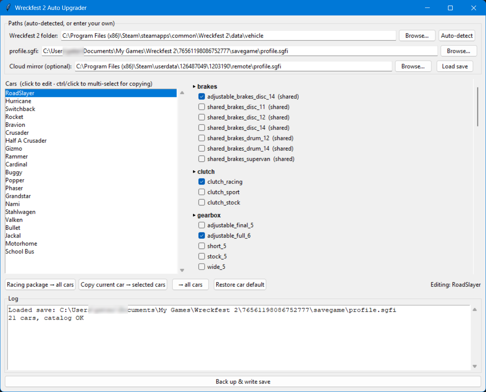

# Wreckfest 2 Auto Upgrader

A small tool that applies your favourite performance parts to every car in your
Wreckfest 2 career save — no more upgrading each car one by one in the garage.

## What you need

- Windows
- Wreckfest 2 installed through Steam (launch it at least once so a save file exists).

## How to use

1. **Close Wreckfest 2 completely.** The game overwrites your save from memory when
   it exits, so always quit it before writing.

2. **Double-click `Wreckfest2AutoUpgrader.exe`** to start it.

3. **Click the "Auto-detect" button.** The three boxes at the top fill in automatically:
   the Wreckfest 2 folder, your `profile.sgfi` save, and the Steam Cloud mirror.
   If anything is missed, use the Browse buttons or type the path yourself.

   

4. Your cars appear in the list on the left. Click a car to see its performance
   parts on the right, one checkbox per option.

5. Pick what you want. Quick options:
   - **Racing package → all cars** — applies the best available part per slot to
     every car in one click.
   - **Copy current car → selected/all cars** — copies the current car's checked
     parts to other cars.
   - **Restore car default** — reverts the selected car to what it currently has.

6. Review your choices, then click **"Back up & write save"**.

7. A pop-up confirms it's done and shows the backup location. Start the game and
   check your cars.

## Backups

Before every write the tool copies both the real save and the Steam Cloud mirror
into a timestamped folder:

```
C:\Users\<you>\.wreckfest2autoupgrader_backups\<timestamp>\
```

Each write gets its own folder, so you can always go back.

## Safety notes

- Always quit Wreckfest 2 before writing the save.
- Only single-slot **performance** categories are edited. Cosmetic parts (body,
  paint, livery, windows, etc.) are never touched.
- A part is never fitted to a car that doesn't support it.
- If Windows shows a SmartScreen **"Windows protected your PC"** warning on first
  run, click **More info** → **Run anyway**. This is normal for an app without a
  paid code-signing certificate; the tool is safe.

## Troubleshooting

- **"Auto-detect" finds the game but not the save:** make sure you've launched
  Wreckfest 2 at least once so a save file exists.
- **Steam Cloud conflict popup on exit:** pick either option — both copies are
  byte-identical, so nothing is lost. Using this tool keeps both copies in sync.